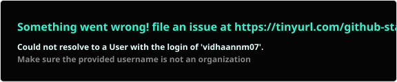

 

  

  

<!-- FUTURISTIC NAVIGATION -->

<table>
<tr>

<td align="center" width="180">

<a href="https://www.linkedin.com/in/vidhaan-mathur-a2b54337/">
  <b>◇ LINKEDIN ↗</b>
</a>

 

PROFESSIONAL

</td>

<td width="18"></td>

<td align="center" width="180">

<a href="https://github.com/vidhaanm07">
  <b>◇ GITHUB ↗</b>
</a>

 

PROJECTS

</td>

<td width="18"></td>

<td align="center" width="180">

<a href="https://leetcode.com/u/vidhaanm07/">
  <b>◇ LEETCODE ↗</b>
</a>

 

PROBLEM SOLVING

</td>

<td width="18"></td>

<td align="center" width="180">

<a href="https://vidhaanmportfolio.vercel.app/">
  <b>◇ PORTFOLIO ↗</b>
</a>

 

MY WORK

</td>

</tr>
</table>

 

SOFTWARE ENGINEER • AI BUILDER • ELECTRONICS ENGINEER • PHOTOGRAPHER

  

---

## `01 — PROFILE`

 

I am **Vidhaan Mathur**, an Electronics Engineering student focused on becoming a **Software Engineer**.

 

My interests sit at the intersection of:

### `SOFTWARE × AI × ELECTRONICS × IoT`

 

I build and explore practical systems involving:

**Software Engineering • AI Agents • GenAI • LLMs • Automation • IoT • Electronics**

 

Currently exploring how intelligent software can interact with real-world systems.

 

---

## `02 — CORE DOMAINS`

 

<table>
<tr>

<td align="center" width="260">

### SOFTWARE

 

Python  
C / C++  
MySQL  
DSA  
APIs  
Automation

</td>

<td align="center" width="260">

### ARTIFICIAL INTELLIGENCE

 

GenAI  
LLMs  
AI Agents  
NLP  
RAG  
MCP

</td>

<td align="center" width="260">

### ENGINEERING

 

Electronics  
Instrumentation  
IoT  
Sensors  
Digital Systems  
Analog Systems

</td>

</tr>
</table>

 

---

## `03 — TECHNOLOGY STACK`

 

### PROGRAMMING

  

### DEVELOPMENT

  

### AI / AUTOMATION

 

`GENAI` • `LLMs` • `AI AGENTS` • `NLP` • `RAG` • `MCP`

  

`n8n` • `OpenAI SDK` • `LangChain` • `Transformers`

 

`Hugging Face` • `Gradio` • `Vapi` • `Clay AI`

  

### ENGINEERING

 

`Digital Electronics` • `Analog Electronics`

 

`Instrumentation` • `Sensors` • `IoT`

 

---

## `04 — FEATURED WORK`

 

<table>

<tr>

<td align="center" width="50%">

### CLOUDNEST AI

 

AI-powered customer support automation system.

 

`n8n` • `LLMs` • `Google Sheets` • `APIs`

  

Classification  
Sentiment Analysis  
Priority Detection  
Team Assignment  
Human-in-the-Loop

  

`CUSTOMER TICKET`
 
↓
 
`AI ANALYSIS`
 
↓
 
`ASSIGNMENT`
 
↓
 
`RESOLUTION`

</td>

<td align="center" width="50%">

### MULTIMODAL AI LAB

 

Exploration of lightweight multimodal AI pipelines.

 

`Hugging Face` • `Transformers` • `Gradio`

  

Whisper  
BLIP  
MobileNet  
Text Pipelines  
Image Pipelines  
Audio Pipelines  
Video Pipelines

  

`TEXT • IMAGE • AUDIO • VIDEO`

</td>

</tr>

<tr>

<td align="center" width="50%">

### HOTEL DATABASE SYSTEM

 

Database management application built using:

 

`Python + MySQL`

  

Structured database operations, data management and application workflows.

</td>

<td align="center" width="50%">

### IoT SIMULATION

 

IoT and electronics simulation using:

 

`Autodesk Tinkercad`

  

Exploring sensors, circuits, embedded concepts and real-world system behaviour.

</td>

</tr>

</table>

 

---

## `05 — AI / AUTOMATION`

 

<table>

<tr>

<td align="center" width="700">

### AI AGENTS

 

Building workflows where LLMs can reason, use tools and perform actions.

</td>

</tr>

<tr>

<td align="center">

### GENERATIVE AI

 

Exploring LLM applications, generative AI and intelligent interfaces.

</td>

</tr>

<tr>

<td align="center">

### MODEL CONTEXT PROTOCOL

 

Exploring MCP and tool-connected AI systems.

</td>

</tr>

<tr>

<td align="center">

### AUTOMATION

 

Building practical workflows using n8n, APIs, AI models and external services.

</td>

</tr>

</table>

 

---

## `06 — EXPERIENCE & LEARNING`

 

### IIT JAMMU — AI INTERNSHIP

**AI (Gen AI, LLMs & AI Agents)**

 

`n8n` • `NLP` • `Vapi` • `Clay AI`

 

`OpenAI SDK` • `Transformers` • `Hugging Face`

 

`Gradio` • `Telegram / WhatsApp Bots`

  

---

### ADVANCED AI LEARNING

**Anthropic Claude with Vertex AI + MCP Advanced**

 

Focused on:

`MCP` • `AI Agents` • `RAG` • `LLM Applications`

  

**n8n Academy — n8n102 Integrations**

  

**Google Cloud Arcade Facilitator Program 2026**

 

---

## `07 — BEYOND CODE`

 

### PHOTOGRAPHY

 

Photography is another way I explore technology, places and perspective.

 

**FAPS Core Team — Photographer**

  

🌍 **25+ Countries**

  

Exploring unique and less-explored places through different perspectives.

 

---

 

---

## `08 — GITHUB SIGNAL`

 

  

 

---

## `09 — CONNECT`

  

<table>
<tr>

<td align="center" width="180">

<a href="https://www.linkedin.com/in/vidhaan-mathur-a2b54337/">

### ◇ LINKEDIN ↗

</a>

 

PROFESSIONAL

</td>

<td width="15"></td>

<td align="center" width="180">

<a href="https://github.com/vidhaanm07">

### ◇ GITHUB ↗

</a>

 

OPEN SOURCE

</td>

<td width="15"></td>

<td align="center" width="180">

<a href="https://leetcode.com/u/vidhaanm07/">

### ◇ LEETCODE ↗

</a>

 

DSA / PROBLEM SOLVING

</td>

<td width="15"></td>

<td align="center" width="180">

<a href="https://vidhaanmportfolio.vercel.app/">

### ◇ PORTFOLIO ↗

</a>

 

SELECTED WORK

</td>

</tr>
</table>

  

  

BUILD • LEARN • EXPERIMENT • REPEAT

  

